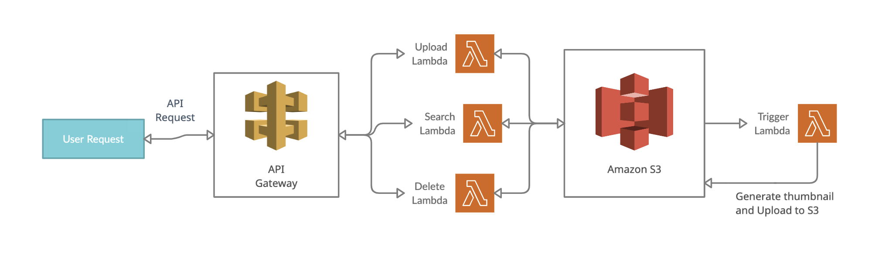

# Serverless Demo Project

</img>

## Prerequisites
----
- AWS Account
- Node and npm
- Serverless CLI

## Commands to deploy project to AWS
----

Install all the dependencies
```
npm install
```

Install sharp dependency of linux platform for AWS
```
npm install --arch=x64 --platform=linux --target=12.13.0 sharp
```

Run configuration script
```
npm run prestart
```

Build serverless package
```
sls package
```

Deploy serverless package
```
sls deploy
```

----
### Follow this link for [API reference](https://github.com/sukhbir-singh/serverless/blob/main/docs/api-doc.md).
